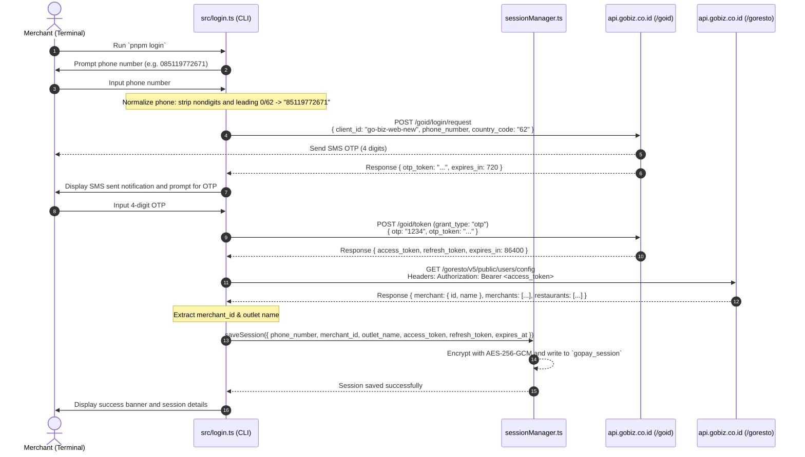
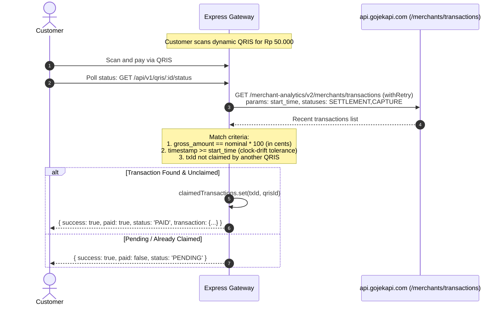

# Gojek / GoBiz API Specification & Gateway Architecture

Technical specifications for internal Gojek / GoBiz APIs integrated by this gateway microservice (`src/login.ts`, `src/services/sessionManager.ts`, and `src/server.ts`), covering OTP authentication, AES-256-GCM session lifecycle, automatic token refresh, and RESTful transaction verification with retry backoff.

---

## Table of Contents
1. [Architecture Overview](#architecture-overview)
2. [REST v1 Endpoint Catalog](#rest-v1-endpoint-catalog)
3. [GoBiz OTP Login Flow (Sequence Diagram)](#gobiz-otp-login-flow-sequence-diagram)
4. [Session Lifecycle & Auto-Refresh Flow](#session-lifecycle--auto-refresh-flow)
5. [QRIS Payment Verification Flow](#qris-payment-verification-flow)
6. [HTTP Header & Device Fingerprint Specification](#http-header--device-fingerprint-specification)
7. [Upstream Gojek / GoBiz API Catalog](#upstream-gojek--gobiz-api-catalog)
   - [1. Request OTP (SMS)](#1-request-otp-login-sms)
   - [2. Verify OTP (Token Exchange)](#2-verify-otp-token-exchange)
   - [3. Auto-Refresh Token](#3-auto-refresh-token)
   - [4. Merchant & Outlet Profile Config](#4-merchant--outlet-profile-config)
   - [5. Transactions & Settlement Analytics](#5-transactions--settlement-analytics)

---

## Architecture Overview

The gateway authenticates through **GoID (GoBiz Web Dashboard)**. The active session is stored encrypted with **AES-256-GCM** in `gopay_session` keyed by `gopay.key` (or `GOPAY_MASTER_KEY`). Upstream network requests include automatic exponential backoff retry.

```
+--------------------+      +-------------------------+      +-------------------------+
|    pnpm login      | ---> | src/services/           | <--- | src/server.ts           |
|  (Interactive CLI  |      | sessionManager.ts       |      | (Express REST v1        |
|    OTP Login)      |      | (AES-256-GCM Storage)   |      |  Gateway + QRIS Engine) |
+--------------------+      +-------------------------+      +-------------------------+
          |                              |                                |
          v                              v                                v
+--------------------------------------------------------------------------------------+
|                           Upstream GoBiz & Gojek Cloud APIs                          |
|  - api.gobiz.co.id (GoID Auth & Resto Config)                                        |
|  - api.gojekapi.com (Merchant Analytics & Settlement Transactions)                  |
+--------------------------------------------------------------------------------------+
```

---

## REST v1 Endpoint Catalog

| HTTP Method | Route | Auth | Description |
|---|---|---|---|
| `POST` | `/api/v1/qris` | API Key (`x-api-key`) | Create dynamic QRIS (`{ "amount": 50000 }`) |
| `GET` | `/api/v1/qris/:id` | Public | QRIS transaction metadata & QR code data |
| `GET` | `/api/v1/qris/:id/status` | Public | Real-time payment verification status polling |
| `GET` | `/qr/:id` | Public | Customer interactive payment landing page (HTML) |
| `POST` | `/api/v1/payments/verify` | API Key (`x-api-key`) | Manual verification of settlement mutation |
| `GET` | `/api/v1/transactions` | API Key (`x-api-key`) | GoPay merchant settlement history |
| `GET` | `/api/v1/session/status` | API Key (`x-api-key`) | GoBiz token and session health status |
| `GET` | `/api/v1/health` | Public | Basic gateway health information |
| `GET` | `/api/v1/healthz` | Public | Liveness & readiness probe (Kubernetes / Docker) |
| `GET` | `/api/v1/logs` | API Key (`x-api-key`) | Gateway in-memory activity logs |

---

## GoBiz OTP Login Flow (Sequence Diagram)



---

## Session Lifecycle & Auto-Refresh Flow

Gojek access tokens typically expire in 24 hours. `sessionManager.ts` implements a **5-minute proactive buffer** prior to token expiration:

```mermaid
flowchart TD
    A[Incoming Request to Gateway<br/>e.g.: GET /api/v1/transactions] --> B[Invoke sessionManager.getValidHeaders()]
    B --> C[loadSession() decrypts gopay_session]
    
    C --> D{Session & access_token exist?}
    D -- No --> E[Return null -> Response 400: Run pnpm login]
    D -- Yes --> F{isExpired(session)?<br/>now >= expires_at - 5 minutes}
    
    F -- Valid --> G[Construct Bearer Auth Headers & Cookies]
    F -- Expired --> H{Does refresh_token exist?}
    
    H -- No --> G
    H -- Yes --> I[refreshSession() with backoff retry]
    
    I --> J[POST https://api.gobiz.co.id/goid/token<br/>grant_type: 'refresh_token']
    J --> K{Refresh Succeeded?}
    K -- Yes --> L[Update access_token & expires_at in gopay_session]
    L --> G
    K -- Failed --> G
    
    G --> M[Send Request with withRetry() to Gojek API]
    M --> N{HTTP 401 Unauthorized?}
    N -- No --> O[Return Transaction Response]
    N -- Yes --> P[Emergency Auto-Refresh & Retry Request]
    P --> O
```

---

## QRIS Payment Verification Flow

Real-time dynamic QRIS verification with nominal matching and **anti double-claim** protection:



---

## HTTP Header & Device Fingerprint Specification

All requests sent to GoBiz/Gojek APIs include standard device headers to pass anti-fraud / WAF validation:

| Header Name | Standard Value | Description |
|---|---|---|
| `accept` | `application/json, text/plain, */*` | Response payload format |
| `accept-language` | `id` | Locale setting |
| `authentication-type` | `go-id` | GoBiz authentication scheme |
| `content-type` | `application/json` | Request payload format |
| `gojek-country-code`| `ID` | Country code |
| `gojek-timezone` | `Asia/Jakarta` | Merchant timezone |
| `origin` | `https://portal.gofoodmerchant.co.id` | GoFood Merchant portal origin |
| `referer` | `https://portal.gofoodmerchant.co.id/` | Portal referer |
| `user-agent` | `Mozilla/5.0 (Windows NT 10.0; Win64; x64) AppleWebKit/537.36 ...` | Browser signature |
| `x-appid` | `go-biz-web-dashboard` | Client app ID |
| `x-appversion` | `platform-v3.111.0-1708bc9a` | Dashboard web platform version |
| `x-deviceos` | `Web` | Platform type |
| `x-phonemake` | `Windows 10 64-bit` | Device machine signature |
| `x-phonemodel`| `Chrome 150.0.0.0 on Windows 10 64-bit` | Browser fingerprint |
| `x-platform` | `Web` | Web platform flag |
| `x-uniqueid` | `UUID v4` | Unique session device ID (must match between Request OTP and Token Verify) |
| `x-user-locale` | `en-GB` | User locale |
| `x-user-type` | `merchant` | User account role |
| `Authorization` | `Bearer <access_token>` | Bearer token for authenticated endpoints |

---

## Upstream Gojek / GoBiz API Catalog

### 1. Request OTP Login (SMS)
- **Method**: `POST`
- **URL**: `https://api.gobiz.co.id/goid/login/request`
- **Auth**: Public (Device Headers)
- **Body**:
  ```json
  {
    "client_id": "go-biz-web-new",
    "phone_number": "85119772671",
    "country_code": "62"
  }
  ```
- **Response (200 OK)**:
  ```json
  {
    "success": true,
    "data": {
      "otp_token": "a1b2c3d4-e5f6-7890-abcd-ef1234567890",
      "expires_in": 720
    }
  }
  ```

---

### 2. Verify OTP (Token Exchange)
- **Method**: `POST`
- **URL**: `https://api.gobiz.co.id/goid/token`
- **Auth**: Public (Device Headers)
- **Body**:
  ```json
  {
    "client_id": "go-biz-web-new",
    "grant_type": "otp",
    "data": {
      "otp": "1234",
      "otp_token": "a1b2c3d4-e5f6-7890-abcd-ef1234567890"
    }
  }
  ```
- **Response (200 OK)**:
  ```json
  {
    "success": true,
    "data": {
      "access_token": "eyJhbGciOiJSUzI1NiIs...",
      "refresh_token": "d98e7f6a-5b4c-3d2e-1f0a-...",
      "token_type": "Bearer",
      "expires_in": 86400
    }
  }
  ```

---

### 3. Auto-Refresh Token
- **Method**: `POST`
- **URL**: `https://api.gobiz.co.id/goid/token`
- **Auth**: Public (Device Headers)
- **Body**:
  ```json
  {
    "client_id": "go-biz-web-new",
    "grant_type": "refresh_token",
    "data": {
      "refresh_token": "d98e7f6a-5b4c-3d2e-1f0a-...",
      "phone_number": "85119772671",
      "country_code": "62"
    }
  }
  ```
- **Response (200 OK)**:
  ```json
  {
    "success": true,
    "data": {
      "access_token": "eyJhbGciOiJSUzI1NiIs...",
      "refresh_token": "d98e7f6a-5b4c-3d2e-1f0a-...",
      "expires_in": 86400
    }
  }
  ```

---

### 4. Merchant & Outlet Profile Config
- **Method**: `GET`
- **URL**: `https://api.gobiz.co.id/goresto/v5/public/users/config`
- **Auth**: `Bearer <access_token>`
- **Response (200 OK)**:
  ```json
  {
    "success": true,
    "data": {
      "merchant": {
        "id": "G123456789",
        "name": "Outlet Coffee Sudirman"
      },
      "merchants": [{ "id": "G123456789", "name": "Outlet Coffee Sudirman" }],
      "restaurants": [{ "id": "R987654321", "name": "Outlet Coffee Sudirman" }]
    }
  }
  ```

---

### 5. Transactions & Settlement Analytics
- **Method**: `GET`
- **URL**: `https://api.gojekapi.com/merchant-analytics/v2/merchants/transactions`
- **Auth**: `Bearer <access_token>` + Cookie
- **Query Parameters**:
  | Param | Example | Description |
  |---|---|---|
  | `from` | `0` | Offset pagination |
  | `size` | `20` | Page size |
  | `statuses` | `SETTLEMENT,CAPTURE,REFUND,PARTIAL_REFUND` | Filter transaction statuses |
  | `payment_types` | `QRIS,GOPAY,OFFLINE_CREDIT_CARD,OFFLINE_DEBIT_CARD,CREDIT_CARD` | Payment channels |
  | `start_time` | `2026-09-10T00:00:00.000Z` | Filter window start (ISO 8601) |
  | `end_time` | `2026-09-10T16:00:00.000Z` | Filter window end (ISO 8601) |
  | `merchant_ids` | `G123456789` | Merchant ID |
- **Response (200 OK)**:
  ```json
  {
    "data": {
      "transactions": [
        {
          "id": "WTRX-123456789",
          "order_id": "ORDER-987654",
          "gross_amount": 2500000,
          "transaction_status": "SETTLEMENT",
          "transaction_time": "2026-09-10T09:15:20.000Z",
          "qris_provider_aspi_issuer": "Bank Central Asia (BCA)",
          "payment_type": "QRIS"
        }
      ]
    }
  }
  ```
